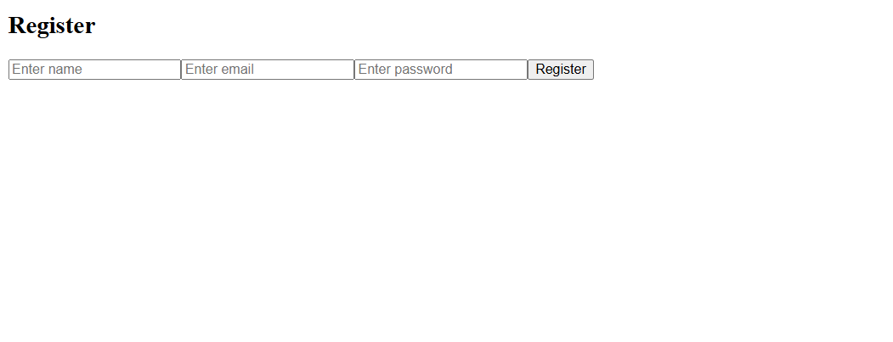
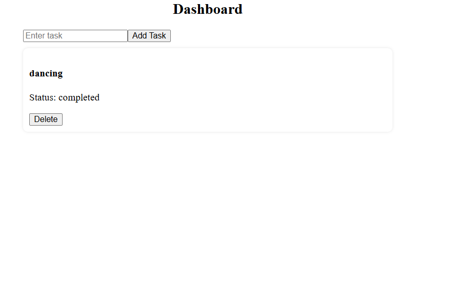

# Task Manager Application (Full Stack)

A full-stack Task Manager application built using **React, Node.js, Express, and MongoDB**.
This app allows users to register, login, and manage their tasks securely using JWT authentication.

---

## Features

### Authentication

* User Registration
* User Login
* JWT-based Authentication
* Protected Routes

###  Task Management

* Create Task
* View Tasks
* Update Task Status (Mark as Completed)
* Delete Task

###  Advanced Features

* Pagination, Filtering, Sorting (Backend)
* Centralized Error Handling
* API Rate Limiting
* Request Logging (Morgan)
* Secure API with Middleware

---

##  Tech Stack

### Frontend

* React.js
* Axios
* React Router DOM

### Backend

* Node.js
* Express.js
* MongoDB (Mongoose)

### Security & Middleware

* JWT (Authentication)
* bcrypt.js (Password hashing)
* express-rate-limit (Rate Limiting)
* Morgan (Logging)
* CORS

---

##  Project Structure

```
task-manager-api/
│
├── frontend/               # React Frontend
│   ├── src/
│   │   ├── components/
│   │   ├── pages/
│   │   ├── services/
│   │   └── context/
│
├── backend files
│   ├── controllers/
│   ├── models/
│   ├── routes/
│   ├── middleware/
│   ├── config/
│   └── server.js
```

---

##  Installation & Setup

###  Clone Repository

```
git clone https://github.com/sricharan-reddy1202/task-manager-api.git
cd task-manager-api
```

---

###  Backend Setup

```
npm install
```

Create `.env` file:

```
MONGO_URI=your_mongodb_connection_string
JWT_SECRET=your_secret_key
PORT=5000
```

Run backend:

```
npm run dev
```

---

###  Frontend Setup

```
cd frontend
npm install
npm start
```

---

##  API Endpoints

### Auth APIs

```
POST /api/auth/register
POST /api/auth/login
```

---

### Task APIs

```
GET    /api/tasks
POST   /api/tasks
PUT    /api/tasks/:id
DELETE /api/tasks/:id
```

---

##  Authentication Flow

```
User Login → JWT Token Generated → Stored in localStorage → 
Sent in Authorization Header → Access Protected Routes
```

---

##  Screenshots

###  Login Page


###  Register Page


###  Dashboard


##  Future Improvements

* Add task deadlines
* Add priority levels
* Drag & Drop task management
* Deploy on cloud (Render / Vercel)

---

##  What I Learned

* Full-stack development using MERN stack
* REST API design and best practices
* JWT authentication & authorization
* Middleware and backend architecture
* Frontend-backend integration
* Debugging real-world issues

---

## Author

**Sricharan Reddy**
GitHub: https://github.com/sricharan-reddy1202

---

##  If you like this project

Give it a ⭐ on GitHub!
